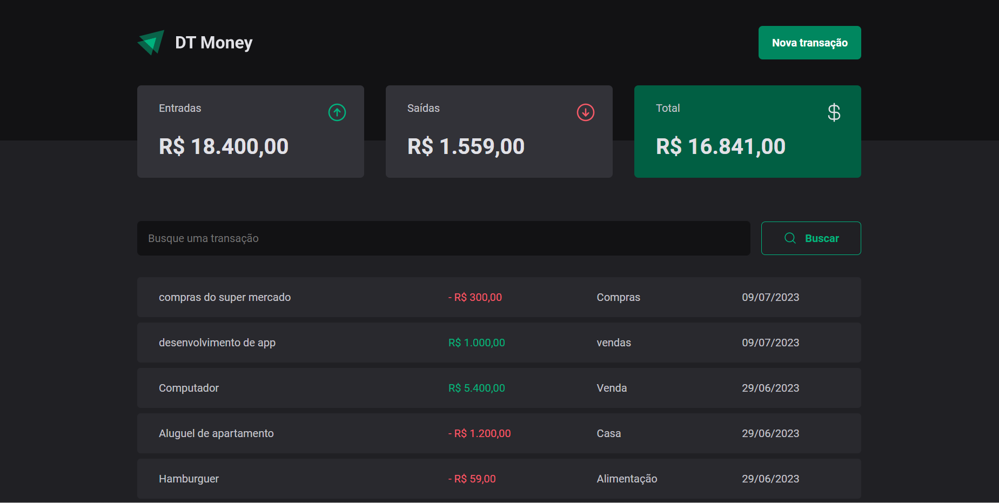
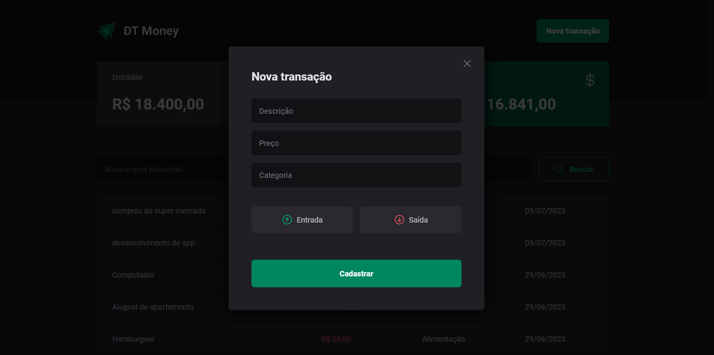

<h1 align="center">DT Money</h1>

Projeto desenvolvido durante estudos sobre consumo de APIs e performance no ReactJs com a Rocketseat utilizando hooks avançados como useCallback e useMemo. DT Money é uma aplicação de controle de transações de entrada e saída que uma pessoa realiza no seu dia a dia, podendo realizar ações de busca de transações e adicionar uma nova transação.

<br>

# Página principal: 


<br>

# Modal de nova transação:


<br/>

# 🚀Tecnologias usadas

- ReactJs
- TypeScript
- Styled-components
- React-hook-form
- Zod
- Axios
- Use-context-selector
- JSON-server API
- Radix-UI
- Vite
- Git e Github

<br/>

# 👉 Features

- Estilização das páginas
- Realizando requisições HTTP
- Criando contexto de transações
- Criando um hook (useSummary)
- Formatando valores de preço e data com o Intl
- Validação de formulário com zod e useForm
- Buscando transações
- Criando nova transação
- Melhorando performance da aplicação


<br/>

# 👨‍💻 Axios

O Axios é uma biblioteca JavaScript popular para fazer requisições HTTP a partir de um navegador ou de um ambiente Node.js. Ela foi importante na aplicação para acessos a API, tanto de busca quanto de criação de transações. 

Documentação: [Docs-Axios](https://axios-http.com/ptbr/docs/intro)

Uso do Axios na aplicação:
````` typescript
// Arquivo axios.ts

import axios from 'axios'

export const api = axios.create({
  baseURL: 'http://localhost:3000',
})

// Arquivo TransactionsContext.tsx

const fetchTransactions = useCallback(async (query?: string) => {
    const response = await api.get('/transactions', {
      params: {
        _sort: 'createdAt',
        _order: 'desc',
        q: query,
      },
    })

    setTransactions(response.data)
  }, [])
`````

<br>

# 👨‍💻 Radix UI

Radix UI é uma biblioteca de componentes UI (Interface do Usuário). Ela fornece uma coleção de componentes reutilizáveis e acessíveis, construídos com React. Foi importante na aplicação para a criação do Modal(Dialog) e do radio(RadioGroup) da aplicação. 

OBS: Talvez não ficará muito bem explicado no código pois estão sendo utilizados componentes estilizados.

Documentação: [Docs-Radix-UI](https://www.radix-ui.com/docs/primitives/overview/introduction)

Uso do Radix-UI na aplicação: 
```` typescript

// Arquivo NewTransactionModal/index.tsx

return (
    <Dialog.Portal>
      <Overlay />
      <Content>
        <Dialog.Title>Nova transação</Dialog.Title>
        <Close>
          <X size={24} color="#7C7C8A" />
        </Close>
        <form onSubmit={handleSubmit(handleCreateNewTransaction)}>
          <input
            type="text"
            placeholder="Descrição"
            required
            {...register('description')}
          />
          <input
            type="number"
            placeholder="Preço"
            required
            {...register('price', { valueAsNumber: true })}
          />
          <input
            type="text"
            placeholder="Categoria"
            required
            {...register('category')}
          />

          <Controller
            control={control}
            name="type"
            render={({ field }) => {
              return (
                <LayoutTransactionType
                  onValueChange={field.onChange}
                  value={field.value}
                >
                  <TransactionTypeButton variant="input" value="input">
                    <ArrowCircleUp size={24} />
                    Entrada
                  </TransactionTypeButton>
                  <TransactionTypeButton variant="output" value="output">
                    <ArrowCircleDown size={24} />
                    Saída
                  </TransactionTypeButton>
                </LayoutTransactionType>
              )
            }}
          />

          <button type="submit" disabled={isSubmitting}>
            Cadastrar
          </button>
        </form>
      </Content>
    </Dialog.Portal>
  )
````
